# PSI/SI解析
------------

## psi/si介绍

### TS流基本结构

如大家所知在开发过程中, ts流基本结构如下:

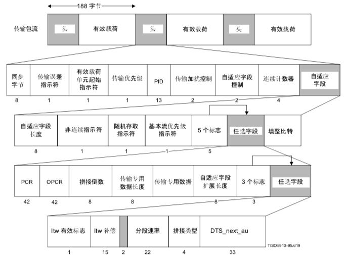

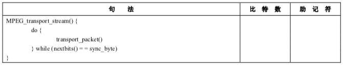

具体的包字段:

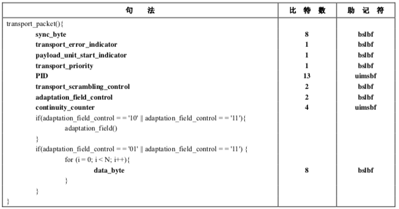

一般我们在解析节目的时候,
会从PAT-\>PMT/NIT-\>SDT得到节目的这个节目名称/供应商和存储音视频数据的包的PID等信息,
再根据该节目的音视频PID去过滤码流, 获得音视频包,
最后获得音视频压缩数据供解码器解码播放.具体结构如下:

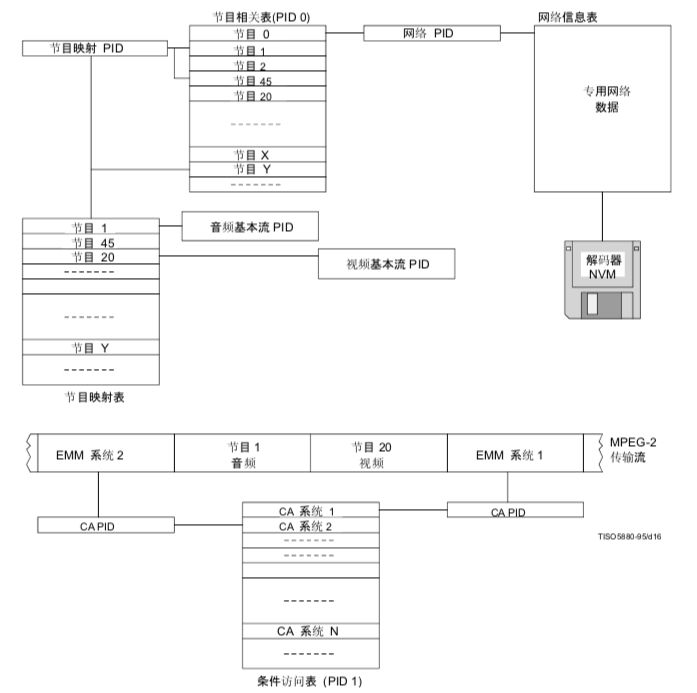

一般我们称获得PSI/SI信息为扫描节目,
平常最常用的是*基本节目信息*和*电子节目指南*(EPG, 由EIT和TOT/TDT等组成)

### PSI(节目特定信息, Program Specific Information)了解

节目特定信息(PSI)包括 ITU-T H.222.0 建议书\| ISO/IEC 13818-1
正式数据和专用数据两部分，以使节目的多路分解能够由解码器完成。节目由一个或多个基本流组成，每个流有一个
PID 签标。节目、基本流
或者它们之中的若干部分可以加扰供有条件访问使用。然而，节目特定信息应不加扰。

传输流中，节目特定信息分成为 6 种表构造，如表 2-28
所示。尽管这些结构可以看作为简单的表，但
它们将被分割成若干分段并插入到传输流包中，一些分段具有预定的
PID，其余的分段具有用户自选的 PID。

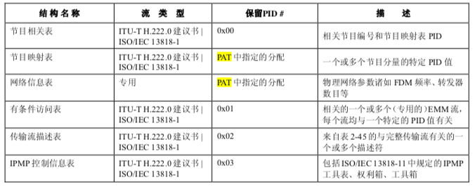

ITU-T H.222.0 建议书\| ISO/IEC 13818-1 规定的 *PSI
表应分割成一个或多个分段*在传输包内承载。每个分 段为一个句法构造，用于提供把每个
ITU-T H.222.0 建议书\| ISO/IEC 13818-1 规定的 PSI 表映射成传输流包。

与 ITU-T H.222.0 建议书\| ISO/IEC 13818-1 规定的 PSI
表一道，承载专用数据表也是可能的。传输流包内承载专用信息的方法不由本规范定义。同样的构造可以用于提供承载
ITU-T H.222.0 建议书\| ISO/IEC
13818-1规定的PSI表，以致映射该专用数据的句法与映射ITU-T H.222.0建议书\| ISO/IEC
13818-1规定的 PSI
表所使用的句法相同。出于此目的，规定专用分段。若承载专用数据的传输流包与承载节目映射表的传
输流包具有相同的 PID 值(如节目相关表中所标识的)，则应使用 private_section
子句法和语义。 private_data_bytes 中承载的数据可以加扰。然而，private_section
的其他字段应无任何必要加扰。此 private_section
允许所传输的数据具有最小的结构。当不使用此结构时，传输流包内专用数据的映射不由本
建议书\|国际标准规定。

分段长度可变。分段的起始端由传输流包有效载荷内的 pointer_field
指示。该字段的句法在表 2-29 中 指定。

自适应字段可在承载 PSI 分段的传输流包中出现。

传输流内，值为 0xFF 的包填充字节仅可在分段最后字节之后承载 PSI 和/或
private_sections 的传输流
包的有效载荷中发现。在此情况中，直至传输流包结束的所有字节也应是值为 0xFF
的填充字节。这些字节 可以被解码器丢弃。在这样的情况中，具有相同 PID
值的下一个传输流包的有效载荷必须随着值为 0x00 的 pointer_field
开始指示自此以后的下一个分段立即起始。

每个传输流必须包含一个或多个具有 PID 值 0x0000
的传输流包。这些传输流包一起应包含完整的节目
相关表，提供传输流内所有节目的完整目录一览。最近传输的具有
current_next_indicator 设置为值‘1’的
该表的版本必定总是适用于传输流中的当前数据。传输流内承载的节目中的任何变化必然在具有
PID 值 0x0000 的传输流包中承载的节目相关表的更新版本中描述。这些分段都应使用
table \_id 值 0x00。仅具有此 table_id 值的分段才被容许在具有 PID 值 0x0000
的传输流包内存在。对于 PAT 的新版本生效而言，具有新 版本号并具有
current_next_indicator 设置为‘1’的所有分段(如 last_section_number
中所指示的)必须退 出 T-STD 中规定的 Bsys(参阅
2.4.2)。当所需要的该分段最后字节完成此表退出 Bsys 时，PAT 方始生效。

每当传输流内一个或多个基本流被加扰时，应传输包含完整有条件访问表的具有 PID 值
0x0001 的传 输流包，该有条件访问表包括同加扰流有关的 CA_descriptors
。传输的所有传输流包应一起组成有条件访 问表的一个完整版本。最近传输的具有
current_next_indicator 设置为值‘1’的该表的版本必定总是适用于
传输流中的当前数据。使得现存表格无效或不完整的加扰中的任何变化必须在该有条件访问表的更新版本
中描述。这些分段都将使用 table_id 值 0x01。仅具有此 table_id
值的分段才被容许在具有 PID 值 0x0001 的传输流包内存在。对于 CAT
的新版本生效而言，具有新版本号并具有 current_next_indicator 设置为‘1’
的所有分段(如 last_section_number 中所指示的)必须退出
Bsys。当所需要的该分段的最后字节完成此表 退出Bsys时，CAT方始生效。

每个传输流必须包含具有 PID 值的一个或多个传输流包，它们在节目相关表内签标为包含
TS_program_map_section 的传输流包。节目相关表中所罗列的每个节目必须在唯一的 TS
节目映射分段中描
述。任何一个节目必须在传输流自身内被完全定义。在适当的节目映射表分段中具备相关
elementary_PID 字
段的专用数据应是该节目的一部分。其他专用数据可在未列入节目映射表分段的传输流中存在。最近传输
的具有 current_next_indicator 设置为值‘1’的 TS_program_map_section
的版本必定总是适用于传输流内的
当前数据。传输流内承载的任何节目的定义中的任何变化必须在具有 PID
值的传输流包中所承载的节目映 射表相应分段的更新版本中描述，该 PID
值标识为那个特定节目的 program_map_PID 。承载给定 TS_program_map_section
的所有传输流包必须具有相同的 PID 值。节目延续存在期间，包括其所有相关事
件，program_map_PID 都应保持不变。节目限定应不跨越多于一个的
TS_program_map_section。当具有新 version_number 并具有 current_next_indicator
值设置为‘1’的那个分段的最后字节退出 Bsys 时，TS 节目映
射分段的新的版本方始生效。

具有 table_id 值 0x02 的分段应包含节目映射表信息。这样的分段可在具有不同 PID
值的传输流包中承载。

网络信息表为任选的并且其内容为专用。若存在，它将在具有相同 PID
值的传输流包内承载，该 PID
称之为网络PID。network_PID值由用户定义，并且只要存在，应在保留program_number
0x0000考虑的节 目相关表中出现。若网络信息表存在，它必须取一个或多个
private_sections 的形式。

42 ITU-T H.222.0建议书 (05/2006)

ISO/IEC 13818-1:2007(C) PSI 表规定的 ITU-T H.222.0 建议书\| ISO/IEC 13818-1
分段中，最大字节数为 1 024 字节。private_section

中最大字节数为 4 096 字节。

传输流描述表为任选的。若存在，传输流描述在具有 PID 值 0x0002
的传输流包内承载，如表 2-28 所
指示的，并应适用于整个传输流。传输流描述的分段必须使用 table_id 值 0x03，如表
2-31 所指示的，并且 其内容受限于表 2-45
中指定的描述符。当要求的该分段的最后字节完成此表退出 Bsys 时，
TS_description_section 方始生效。

在起始码、同步字节或 PSI
数据中的其他比特模式出现的地方不存在任何限制，无论是本建议书\|国际
标准数据流还是专用数据流。

节目相关表 (PAT)

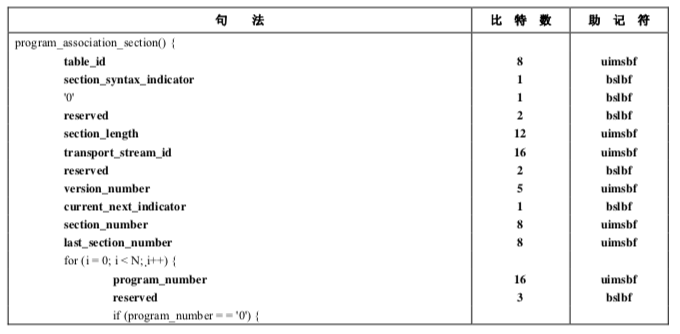

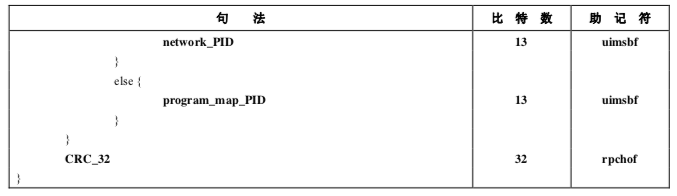

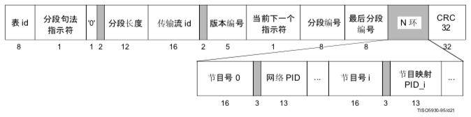

每个传输流必须包含一个完整有效的节目相关表。节目相关表给出 program_number
与携带那个节目定 义的传输流包的 PID(PMT_PID)之间的对应。PAT
映射成传输流包之前，它可以被分割成最多 255 个分 段。每个分段承载该全部 PAT
的一个部分。为在误差条件下极小化数据丢失，此分割或许是合适的。即，
包丢失或比特差错可以局限于该 PAT
的较小分段，这样允许其他的分段仍旧被接收和正确解码。若所有 PAT
信息放置在一个分段，则例如，引发 table_id 中一个变化的比特差错将引起整个 PAT
的丢失。然而，只要 该分段未扩展超出 1024 字节的最大长度限制，这仍旧是容许的。

节目 0(零)被保留并用于指定网络 PID。这是指向承载网络信息表的传输流包的指针。

传输节目相关表无须加密。

节目映射表 (PMT)

节目映射表提供节目编号与构成它的节目元之间的映射。此表在具有一个或多个专门选择的
PID 值的 传输流包中存在。这些传输流包可以包含由 table_id
字段所规定的其他专用构造。可能具有这样的 TS PMT 分段，它涉及具有公共 PID
值的传输流包中所承载的不同节目。

本建议书\|国际标准要求一个最小的节目标识:节目编号、PCRPID、流类型以及节目元
PID。节目或基 本流的另外信息可通过使用描述符()句法来传送。参阅 C.8.6。

专用数据也可以在作为承载 TS 节目映射表分段所指明的传输流包中发送。通过使用
private_section() 来实现这一过程。在 private_section()中，该应用决定
version_number 和 current_next_indicator 是否代表单一
分段的这些字段的值或者它们是否适用于作为一个较大专用表的一个部分的诸多分段。

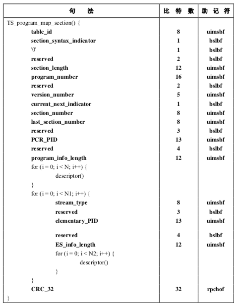

注 1 — 传输包含节目映射表的传输流包不加密。

注 2 —
在TS_program_map_section()字段内承载的专用描述符中的事件上传输信息是可能的。

C.8.3 有条件访问表 (CAT)

有条件访问(CA)表给出一个或多个 CA 系统、它们的 EMM
流和与它们有关的任何特定参数之间的 关系。

注 — 包含EMM和CA参数的传输流包的(专用)内容只要存在，一般将加密(加扰)。

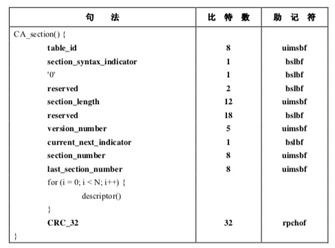

C.8.4 网络信息表 (NIT)

NIT 的内容为专用且不由本建议书\|国际标准指定。一般而言，它将包括的具有
transport_stream_id、信
道频率、卫星转发器个数、调制解调特性等的用户自选业务的映射。

C.8.5 Private_section()

Private_sections()能够以两种基本格式出现:短版本(仅包含直至并包括 section_length
字段在内的所有 字段)或长版本(直至并包括 last_section_number
字段在内的所有字段均存在，并且专用数据字节之后 CRC_32 字段也存在)。

Private_section()能够在被称为 PMT_PID 的 PID 中出现，或在唯一包含
private_sections()的具有其他 PID 值的传输流包中出现，该 PID 值包括分配给 NIT 的
PID。若承载专用分段()的传输流包的 PID 被标识为承 载专用分段的 PID(stream_type
赋值为 0x05)，则仅 private_sections 可在那个 PID 值的传输流包中出现。该
分段可以是长版本类型或短版本类型。

C.8.6 描述符

本建议书\|国际标准中存在若干规定的标准描述符。许多额外的专用描述符也可定义。所有描述符均有
一个共同的格式:{标记，长度，数据}。任何专门定义的描述符必须遵从此格式。这些专用描述符的数据
部分专门定义。

当一个描述符(CA_descriptor())在TS
PMT分段中出现时，它用于指示与节目元有关的ECM数据的 位置(传输包的 PID 值)。当在
CA 分段中出现时，它涉及 EMM 数据的位置。

为了扩展有效的 private_descriptors 的个数，可能使用以下机制:可以专门定义专用
descriptor_tag 作为 一个复合描述符来构造。这需要专门规定一个更深层的
sub_descriptor 作为该专用描述符的专用数据字节的
首字段。所描述的结构分别在下两个表中指示。

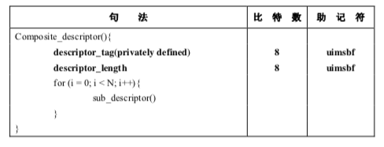

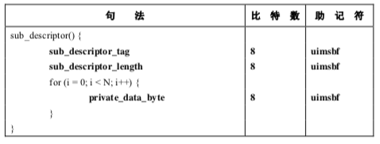

### SI(节目特定信息, Service Information)了解

GB/T 17975.1-2000 中的业务信息被称为节目特定信息(PSI)。PSI
数据提供了使能够接收机自动配置的信息，用于对复用流中的不同节目流进行解复用和解码。
PSI 信息由四种类型表组成。每类表按段传输。

1)节目关联表(PAT):

 针对复用的每一路业务，PAT 提供了相应的节目映射表(PMT)的位置(传输流(TS)包
的包标识符(PID)的值)，同时还提供网络信息表(NIT)的位置。

2)条件接收表(CAT):
条件接收表提供了在复用流中条件接收系统的有关信息。这些信息属于专用数据(未在本

标准中定义)，并依赖于条件接收系统。当有 EMM 时，它还包括了 EMM 流的位置。

3)节目映射表(PMT):

 节目映射表标识并指示了组成每路业务的流的位置，及每路业务的节目时钟参考(PCR)
字段的位置。

4)网络信息表(NIT): 本标准定义的 NIT 表的位置符合 GB/T 17975.1-2000
规范，但数据格式已超出了 GB/T

17975.1-2000 的范围，这是为了提供更多的有关物理网络的信息。本标准中还定义了网

络信息表的语法及语义。除了 PSI
信息，还需要为用户提供有关业务和事件的识别信息。本标准定义了这些数据的编码。PSI

中的 PAT、CAT、PMT
只提供了它所在的复用流(现行符复用流)的信息，在本标准中，业务信息还提供
了其他复用流中的业务和事件信息。这些数据由以下九个表构成:

1)业务群关联表(BAT):
业务群关联表提供了业务群相关的信息，给出了业务群的名称以及每个业务群中的业务列

表。

2)业务描述表(SDT):

 业务描述表包含了描述系统中业务的数据，例如业务名称、业务提供者等。

3)事件信息表(EIT):

 事件信息表包含了与事件或节目相关的数据，例如事件名称、起始时间、持续时间等。

 不同的描述符用于不同类型的事件信息的传输，例如不同的业务类型。

4)运行状态表(RST):

 运行状态表给出了事件的状态(运行/非运行)。运行状态表更新这些信息，允许自动适
时切换事件。

5)时间和日期表(TDT):
时间和日期表给出了与当前的时间和日期相关的信息。由于这些信息频繁更新，所以需要

使用一个单独的表。

6)时间偏移表(TOT):

 时间偏移表给出了与当前的时间、日期和本地时间偏移相关的信息。由于时间信息频繁更
新，所以需要使用一个单独的表。

7)填充表(ST): 填充表用于使现有的段无效，例如在一个传输系统的边界。

8)选择信息表(SIT):
选择信息表仅用于码流片段(例如，记录的一段码流)中，它包含了描述该码流片段的业

务信息的概要数据。 9)间断信息表(DIT):

 间断信息表仅用于码流片段(例如，记录的一段码流)中，它将插入到码流片段业务信息
间断的地方。

当应用这些标识符时，允许灵活地组织这些表，并允许将来兼容性扩展。

总体结构如下:

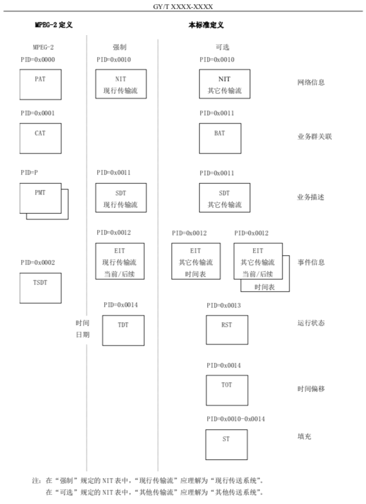

本标准中的业务信息(SI)表与 MPEG-2 中的 PSI
表，都被分成为一个或若干个段表示，然后插入

到TS包中。第 4 部分中所列的表是概念性的，在 IRD 中无需以特定的形式重新生成。除了
EIT 表外，业务信息

表在传送过程中不能被加扰，但如果需要，EIT 表可以加扰(见
5.1.5)。段是一种用来把在所有的 MPEG-2 表和本标准中规定的 SI 表映射成 TS
包的语法结构。这些业务信

息语法结构符合 GB/T 17975.1-2000 定义的专用段语法结构。 5.1.1 说明

段的长度是可变的。除 EIT 表外，每个表中的段限长为 1024 字节，但 EIT 中的段限长
4096 字节。 每一个段由以下元素的组合唯一标识:a) 表标识符(table_id):

\- 表标识符标识段所属的表;- 一些表标识符已分别被 ISO 和 ETSI
定义。表标识符的其它值可以由用户根据特定目的自行分

配。表标识符值的列表见表 2。b) 表标识符扩展(table_id_extentsion):

\- 表标识符扩展用于标识子表;

\- 子表的解释见 5.2。 c) 段号(section_number):

\-
段号字段用于解码器将特定子表的段以原始顺序重新组合。本标准建议段按顺序传输，除非某
些子表的段需要比其它的段更频繁地传输，例如出于随机存取的考虑;

\- 在本标准中指定的各种业务信息表，段编号也适用于子表。 d)
版本号(version_number):

\-
当本标准中规定的业务信息所描述的传输流特征发生变化时(例如:新事件开始，给定业务的
组成的基本流发生变化)，应发送更新了的业务信息数据。新版本的业务信息以传送一子表为
标志，它与前子表具有相同的标识符，但版本号改为下一值;

\- 本标准中规定的业务信息表，版本号适用于一个子表的所有段。 e)
当前后续指示符(current_next_indicator):

\- 每一段都要标以“当前”有效或“后续”有效。它使得新的 SI
版本可以在传输流特征发生变
化之前传输，让解码器能够为变化做准备。然而，一个段的下一个版本的提前传输不是必需的，
但如果被传输，它将成为该段的下一个正确版本。

5.1.2 段到传输流(TS)包的映射

段可直接映射到 TS 包中。段可能起始于 TS
包有效负载的起始处，但这并不是必需的，因为 TS 包

的有效负载的第一个段的起始位置是由 pointer_field 字段指定的。一个 TS
包内决不允许存在多余一
个的pointer_field字段，其余段的起始位置均可从第一个段及其后各段的长度中计算出来，这是因为
语法规定一个传输码流的段之间不能有空隙。

在任一 PID 值的 TS
包中，一个段必须在下一个段允许开始之前结束，否则就无法识别数据属于哪
个段标题。若一个段在 TS
包的末尾前结束了，但又不便打开另一个段，则提供一种填充机制来填满剩
余空间。该机制对包中剩下的每个字节均填充为 0xFF。这样 table_id 就不允许取值为
0xFF，以免与填 充相混淆。一旦一个段的末尾出现了字节 0xFF，该 TS
包的剩余字节必然都被填充为 0xFF，从而允许解 码器丢弃 TS
包的剩余部分。填充也可用一般的 adaptation_field 机制实现。

段在传输流中的映射机制及功能，2.4.4 节，附录 C 及 GB/T 17975.1-2000
有更详尽的描述。

5.1.3 PID及表标识符字段编码

下表列出了用于传送业务信息段的 TS 包的 PID 值。

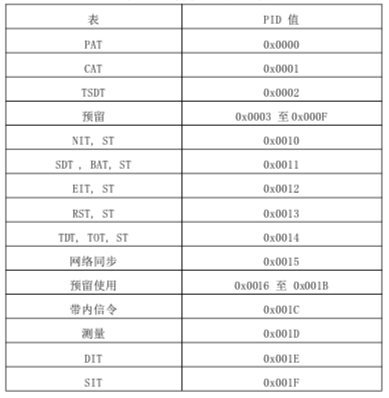

### 强化section的理解

PSI和SI中都有section的概念,刚开始学习MPEG-2 TS流解析时，看ISO/IEC
13818-1的文档上面的PAT，PMT表：program_association_section()和TS_program_map_section（）时，很容易就以为可以直接从188字节的TS
packet中取数据填到各个字段中，网上也可以搜到这样类似的程序：

void ParsePat(psi_pat \*p_pat， uint8_t \*p_packet)  

{  

 // declare variables and initial  

 ...  

 // get payload_unit_start_indicator   

 b_pusi = p_packet[1] & 0x40;  

 b_adaptation = p_packet[3] & 0x20;  

 // calculate the skip to skip to payload field  

 if(b_adaptation)  

 {  

  skip = 5 + p_packet[4];  

 }  

 else  

 {  

  skip = 4;  

 }  

 // skip pointer_field  

 if(b_pusi)  

 {  

  skip = skip + p_packet[skip] + 1;  

 }  

 // now skip to payload field  

 p_payload = p_packet + skip;  

 // now parse table  

 p_pat-\>table_id = p_payload[0];  

 ...  

}  

这样在解析PAT和PMT表时往往也能得到正确的答案，这是因为PAT，PMT表数据量比较小的缘故。其实在TS流中还有一个重要的概念——section。文档中program_association_section()和TS_program_map_section()指的就是PAT
section和PMT
section。它们中都有一个字段：section_length，文档告诉我们这个字段值的是此字段之后section的字节数，除了EIT
section的最大字节数是4096外，其他section最大字节数是1024字节。 而TS
packet最大只有188字节，因此这里需要考虑section到packet的映射问题，基本上存在三种情况：

1、section对应一个packet

2、section太长，在几个连续的packet中

3、在一个packet的负载中结束上一个section之后马上开始了一个新的section。

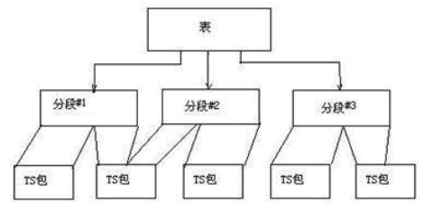

下面将以EIT表举例

### EIT表

事件信息表 EIT(见下表)按时间顺序提供每一个业务所包含的事件的信息。按照不同
table_id，有四类 EIT:

1) 现行传输流，当前/后续事件信息= table_id = "0x4E";

2) 其它传输流，当前/后续事件信息= table_id = "0x4F";

3) 现行传输流，事件时间表信息= table_id = "0x50" 至 "0x5F";

4) 其它传输流，事件时间表信息= table_id = "0x60" 至 "0x6F"。

现行传输流的所有 EIT 子表都有相同的 transport_stream_id 和 original_network_id。
除准视频点播(NVOD)业务之外，当前/后续表中只包含在现行传输流或其他传输流中指定业务的

当前事件和按时间顺序排列的后续事件的信息，因为 NVOD
业务可能包含两个以上的事件描述。无论是
对现行传输流还是其他传输流，事件时间表都包含了以时间表的形式出现的事件列表，这些事件包括下
一个事件之后的一些事件。EIT 时间表是可选的，事件信息按时间顺序排列。

按照下表语法，EIT 表被切分成事件信息段。任何构成 EIT 表的段，都要由 PID 为
0x0012 的 TS 包 传输。

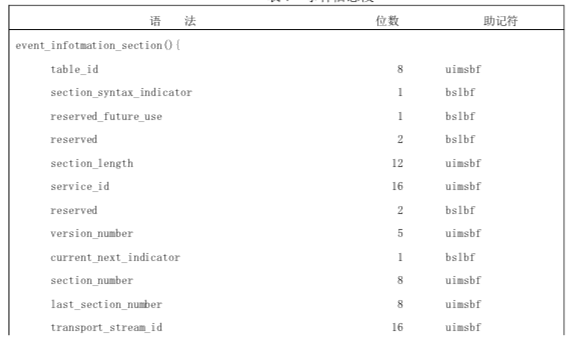

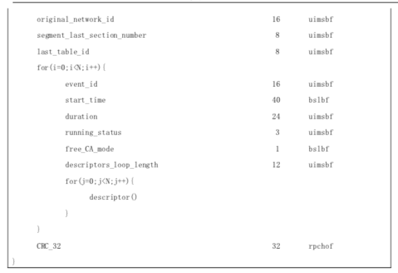

对于当前事件有如下规定：

1.同一时刻最多只有一个当前[事件](https://baike.baidu.com/item/%E4%BA%8B%E4%BB%B6/33582)。

2.当存在一个当前事件时，该事件应该被描述在EIT Present/Following的section0中。

3.当前事件中的running_status应当被给出。

4.在同一时刻，最多有一个following event.

5.如果following event存在，该事件应当在EIT Present/Following的section1中。

6.如果following event不存在，则传输一个section1为空的EIT Present/Following。

7.Following event的running_status应当给出。

事件的持续时间和EIT持续事件一样，必须包含事件被设置为“not
running”或者“pausing”。事件的开始时间和EIT
start_time一样，应当是整个事件的开始事件，而不是从pause恢复后的时间。

注意：一个事件的开始时间加上它的持续时间可能比following
event的开始时间要小。换句话说，允许事件之间有间隔。在这种情况下，following
event被看作是间隔后的事件，这个事件应当编在EIT Present/Following的secting1中。

注意：开始时间和持续时间都是预定的，一些广播服务提供商可能会更新这些信息，而另外一些则更愿意保持开始时间不变。例如为了避免名为“8点新闻”的事件被误解，把信息中的开始事件从8：01：23改为8：00：00。

EIT Schedule结构：

一、EIT Schedule结构遵从如下规则：

1、EIT/Schedule分配了16个table_id,0x50-0x5F给当前TS，0x60-0x6F给其它TS，这些id按照时间顺序排列；

2、子表下的256个section被分为32段（segment）,每8个section一个字段（segment）.
segment \#1、从section0到7、segment \#2、从section8到15等等

3、每段包含三个小时内开始的事件信息；

4、段内事件信息按照事件排列；

5、如果一个段（segment）有n节（section）,而n\<8,这个信息必须放在段前n个节中，还要显示指明最后一节的位置：S0+n-1(S0是段中第一节)，这个值在EIT的segment_last_section_number中。例如，第二段只有两节，那么segment_last_section_number包含值8+2-1=9；

6、如果段中有节的话，段的segment_last_section_number应当有值s0+7;

7、完全空的段通过空节（不包含loop
over事件）表示，段的vsegment_last_section_number值为s0+0

8、段中事件的安排遵从一个时间t0.

T0是通过时间坐标（Universal Time Coordinated(UTC)）的“last midnight”。

举个例子：UTC-6的下午5点，就是UTC-0的下午11点，即从：last
midnight”算起23小时。因此对于UTC-6,t0就是前一天的下午6点；

table_id
0x50（对于其它TS是0x60）的第0段，包含从午夜（UTC时间）到“今天”02：59：59（UTC时间）（三个小时）的事件信息。第一段包含从03：00：00到05：59：59（UTC时间）的事件信息。依此类推，这就意味着第一个子表包含“今天”UTC午夜时间算起4天的信息；

9、last_section_number用来指明子表的结束位置；

10、last_table_id用来指明整个EIT/Schedule结构的结束位置；

11、与过去相关的段可以用空段代替，参见7规则；

12、EIT/Schedule包含的时间定义中的running_status应当设为“为定义”即0x00；

13、EIT/Schedule表不适用于NVOD涉及的服务，因为这些服务带有未定义开始时间的事件；

二、EIT加密

EIT Schedule表格可以被加密，为了与条件接入相联系，必须分配一个service_id(=MPEG-2
program_number)来描述加密的EIT Schedule
Tables，这个service_id在PSI中。EIT在PMT中定义，service_id看成由一个private
steam组成的各种电视节目（The EIT is identified in the Program Map
Table(PMT)section for this service_id as a programme consisting of one private
steam）,PMT包含一个或者多个CA_descriptor来验证相关的CA码流。为达到这个目的，在DVB应用程序中service_id的值0xFFFF被保留。

在EIT
present/following表中，每一事件都用一个event_id来标识它，每一个事件的顺序关系（当前正在发生的事件/后续发生的事件）就由EIT
present/following来描述。

那么如何来识别当前正在发生的事情和后续发生的事情呢？那是通过event_id来标识的，如图5所示。图中event_id=0x49表示当前正在发生的事件；event_id=0x4A表示后续发生的事件。那么在当前事件完成进入后续事件时，此时的后续事件变成当前事件，后续事件将由一个新的事件代替。这一变化是使用version_number来加以描述的。

例如：

当前播出 19：00-19：30 新闻联播 event_id=0x49；

后续播出 19：31-20：00 动画片 event_id=0x4A，此version_number=0

设新的后续 21：01-21：45 曲艺节目。当新闻联播完成后，则变化为：

当前播出 19：31-20：00 动画片 event_id=0x49；

后续播出 21：01-21：45 曲艺节目 event_id=0x4A，此version_number=1

## libdvbpsi 源代码学习

### 认识libdvbpsi

libdvbpsi是vlc中的一个解码库。它能解码或解析出所有的节目专用信息（PSI）以及MPEG2
TS流或DVB流中的描述符(descriptor)。

目前能解析的PSI/SI表包括( BAT，CAT，EIT，NIT，PAT，PMT，SDT，SIS，TOT，TDT).

BAT：Bouquet Association Table 业务关联表

CAT：Conditional Access Table 条件接入表

EIT：Event Information Table 事件信息表(EPG)

NIT: Network Information Table 网络信息表

PAT: Program Association Table 节目关联表

PMT: Program Map Table 节目映射表

SDT: Service Description Table 业务描述表

libdvbpsi主页： <http://www.videolan.org/developers/libdvbpsi.html>

其中涉及到的DVB规范如下：

系统: ISO/IEC 13818-1

视频编码: ISO/IEC 13818-2

音频编码。 ISO/IEC 13818-3

DVB官网：<http://www.dvb.org/>

此处笔者使用的是version 1.3.2.

### 架构分析

libdvbpsi 1.3.2源码目录结构如下：

.

├── demux.c 解复用器

├── descriptor.c 各种描述符数据的抽象

├── descriptors 各种描述符的解析

│   ├── dr.h

│   ├── dr_02.c

│   ├── dr_02.h

│   ├── …

├── dvbpsi.c 抽象成DVB/PSI decoders，封装出接口，供应用层调用。

├── psi.c psi section structure

└── tables 各种psi子表解析的具体实现

├── eit.c eit表结构

├── pat.c pat表结构

├── pmt.c pmt表结构

每个解码器被划分成两个实体：即the PSI decoder和the specific
decoder。之所以如此划分的原因是，每个psi表的section都有相同的格式。

解码器结构如图1所示：

图1：解码器结构

PSI解码器：主要任务就是获取应用层提供的ts流数据包（
STB则是根据底层的解码器芯片获取ts流），并将完整的psi
section(段)发送给专用的解码器解析。对于不连续的ts流，PSI解码器也必须稳定可靠的工作，并将ts流交给专用的解码器处理。

专用解码器(specific decoder)：主要任务就是根据psi解码器提供的psi
sections，重建完整的表(PSI/SI)并将
他们返回给应用层处理(STB通常是存入相应的database)，同时还要根据psi
decoder的指示去检查ts的完整性(作CRC校验)。如果不完整，则返回错误。

PSI
decoder可理解为对每个具体专用解码器相同特征或行为的抽象，也就是抽象出一个类：decoder，而每个具体的decoder则是具体的类的对象或实例，所以要具体实现。用C语言的解释就是抽象出decoder的接口（Interface），要使用哪个解码器则传入不同的回调函数/函数指针（callback）。

（注：从这里可以看到，函数指针是实现多态的手段，而多态就是隔离变化的秘诀）

### dvbpsi_packet_push函数分析

在1.4节中, section到packet的映射问题, 存在三种情况可以在libdvbpsi源码的bool
dvbpsi_packet_push(dvbpsi_t \*p_dvbpsi, uint8_t\*
p_data)函数中找到。明白了这三种情况，再对照函数的注释，应该就不难看懂这个函数了。

*/\*\*\*\*\*\*\*\*\*\*\*\*\*\*\*\*\*\*\*\*\*\*\*\*\*\*\*\*\*\*\*\*\*\*\*\*\*\*\*\*\*\*\*\*\*\*\*\*\*\*\*\*\*\*\*\*\*\*\*\*\*\*\*\*\*\*\**

* \* dvbpsi_PushPacket *

* \*\*\*\*\*\*\*\*\*\*\*\*\*\*\*\*\*\*\*\*\*\*\*\*\*\*\*\*\*\*\*\*\*\*\*\*\*\*\*\*\*\*\*\*\*\*\*\*\*\*\*\*\*\*\*\*\*\*\*\*\*\*\*\*\*\* *

* \* Injection of a TS packet into a PSI decoder. *

* \*\*\*\*\*\*\*\*\*\*\*\*\*\*\*\*\*\*\*\*\*\*\*\*\*\*\*\*\*\*\*\*\*\*\*\*\*\*\*\*\*\*\*\*\*\*\*\*\*\*\*\*\*\*\*\*\*\*\*\*\*\*\*\*/  *

*bool dvbpsi_packet_push(dvbpsi_t \*p_dvbpsi, uint8_t\* p_data)*

*{  *

*  uint8_t i_expected_counter;           /\* Expected continuity counter \*/  *

*  dvbpsi_psi_section_t\* p_section;      /\* Current section \*/  *

*  uint8_t\* p_payload_pos;               /\* Where in the TS packet \*/  *

*  uint8_t\* p_new_pos = NULL;            /\* Beginning of the new section， *

*                                           updated to NULL when the new *

*                                           section is handled \*/  *

*  int i_available;                      /\* Byte count available in the *

*                                           packet \*/  *

*                                        /\* 本次放进来的packet的负载字节数 \*/  *

*  /\* TS start code \*/  *

*  if(p_data[0] != 0x47)  *

*  {  *

*    DVBPSI_ERROR("PSI decoder"， "not a TS packet");  *

*    return;  *

*  }  *

*  /\* Continuity check \*/  *

*  i_expected_counter = (h_dvbpsi-\>i_continuity_counter + 1) & 0xf;  *

*  h_dvbpsi-\>i_continuity_counter = p_data[3] & 0xf;  *

*  if(i_expected_counter == ((h_dvbpsi-\>i_continuity_counter + 1) & 0xf)  *

*      && !h_dvbpsi-\>b_discontinuity)  *

*  {  *

*    DVBPSI_ERROR_ARG("PSI decoder"，  *

*                     "TS duplicate (received %d， expected %d) for PID %d"，  *

*                     h_dvbpsi-\>i_continuity_counter， i_expected_counter，  *

*                     ((uint16_t)(p_data[1] & 0x1f) \<\< 8) \| p_data[2]);  *

*    return;  *

*  }  *

*  if(i_expected_counter != h_dvbpsi-\>i_continuity_counter)  *

*  {  *

*    DVBPSI_ERROR_ARG("PSI decoder"，  *

*                     "TS discontinuity (received %d， expected %d) for PID %d"，  *

*                     h_dvbpsi-\>i_continuity_counter， i_expected_counter，  *

*                     ((uint16_t)(p_data[1] & 0x1f) \<\< 8) \| p_data[2]);  *

*    h_dvbpsi-\>b_discontinuity = 1;  *

*    if(h_dvbpsi-\>p_current_section)  *

*    {  *

*      dvbpsi_DeletePSISections(h_dvbpsi-\>p_current_section);  *

*      h_dvbpsi-\>p_current_section = NULL;  *

*    }  *

*  }  *

*  /\* Return if no payload in the TS packet \*/  *

*  if(!(p_data[3] & 0x10))  *

*  {  *

*    return;  *

*  }  *

*  /\* Skip the adaptation_field if present \*/  *

*  if(p_data[3] & 0x20)  *

*    p_payload_pos = p_data + 5 + p_data[4];  *

*  else  *

*    p_payload_pos = p_data + 4;  *

*  /\* Unit start -\> skip the pointer_field and a new section begins \*/  *

*  /\* payload_unit_start_indicator 为1时不仅有一个pointer_field指针，更意味着一个新的分段section开始 \*/  *

*  if(p_data[1] & 0x40)  *

*  {  *

*    p_new_pos = p_payload_pos + \*p_payload_pos + 1;  *

*    p_payload_pos += 1;  *

*  }  *

*  /\* 用来判断上个分段是否结束，为NULL表示上个分段结束了并已被收集 \*/  *

*  p_section = h_dvbpsi-\>p_current_section;  *

*  /\* If the psi decoder needs a begginning of section and a new section *

*     begins in the packet then initialize the dvbpsi_psi_section_t structure \*/  *

*  /\* 上个分段结束，一般就开始新的分段(payload_unit_start_indicator为1)，否则错误直接返回 \*/  *

*  if(p_section == NULL)  *

*  {  *

*    if(p_new_pos)  *

*    {  *

*      /\* Allocation of the structure \*/  *

*      h_dvbpsi-\>p_current_section  *

*                        = p_section  *

*                        = dvbpsi_NewPSISection(h_dvbpsi-\>i_section_max_size);  *

*      /\* Update the position in the packet \*/  *

*      p_payload_pos = p_new_pos;  *

*      /\* New section is being handled \*/  *

*      p_new_pos = NULL;  *

*      /\* Just need the header to know how long is the section \*/  *

*      /\* 开始新的分段，先读分段的header，到section_length刚好3字节，主要是要先读section_length用来确定此分段有多少字节。 \*/  *

*      h_dvbpsi-\>i_need = 3;  *

*      h_dvbpsi-\>b_complete_header = 0;  *

*    }  *

*    else  *

*    {  *

*      /\* No new section =\> return \*/  *

*      return;  *

*    }  *

*  }  *

*  /\* Remaining bytes in the payload \*/  *

*  /\* p_payload_pos = p_data + offset， 其中offset是section包头的长度 \*/  *

*  /\* 所以，i_available = 188 - offset \*/  *

*  i_available = 188 + p_data - p_payload_pos;  *

*  while(i_available \> 0)  *

*  {  *

*    /\* h_dvbpsi-\>i_need 用来记录该分段还差多少个字节才结束分段 \*/  *

*    /\* 此包的负载足够填充当前分段，需要考虑： *

*      \* 1、如果已经填充过分段的header，则将此包的负载追加到分段数据的末尾即结束此分段，并调用h_dvbpsi-\>pf_callback收集当前section以完成一个子表  *

*      \*     这个时候还要判断，如果此包的负载还有剩余，并且不是填充字段（0xff）则意味着直接开始了一个新的分段。 *

*      \* 2、如果还没有填充过分段的header，则分析段的header，主要是section_length字段用来更新h_dvbpsi-\>i_need \*/  *

*    if(i_available \>= h_dvbpsi-\>i_need)  *

*    {  *

*      /\* There are enough bytes in this packet to complete the *

*         header/section \*/  *

*      memcpy(p_section-\>p_payload_end， p_payload_pos， h_dvbpsi-\>i_need);  *

*      p_payload_pos += h_dvbpsi-\>i_need;  *

*      p_section-\>p_payload_end += h_dvbpsi-\>i_need;  *

*      i_available -= h_dvbpsi-\>i_need;  *

*      if(!h_dvbpsi-\>b_complete_header)  *

*      {  *

*        /\* Header is complete \*/  *

*        h_dvbpsi-\>b_complete_header = 1;  *

*        /\* Compute p_section-\>i_length and update h_dvbpsi-\>i_need \*/  *

*        /\* 分段已经读了3个字节也即读到section_length字段，恰恰还需要section_length个字节 \*/  *

*        h_dvbpsi-\>i_need = p_section-\>i_length  *

*                         =   ((uint16_t)(p_section-\>p_data[1] & 0xf)) \<\< 8  *

*                           \| p_section-\>p_data[2];  *

*        /\* Check that the section isn't too long \*/  *

*        if(h_dvbpsi-\>i_need \> h_dvbpsi-\>i_section_max_size - 3)  *

*        {  *

*          DVBPSI_ERROR("PSI decoder"， "PSI section too long");  *

*          dvbpsi_DeletePSISections(p_section);  *

*          h_dvbpsi-\>p_current_section = NULL;  *

*          /\* If there is a new section not being handled then go forward *

*             in the packet \*/  *

*          if(p_new_pos)  *

*          {  *

*            h_dvbpsi-\>p_current_section  *

*                        = p_section  *

*                        = dvbpsi_NewPSISection(h_dvbpsi-\>i_section_max_size);  *

*            p_payload_pos = p_new_pos;  *

*            p_new_pos = NULL;  *

*            h_dvbpsi-\>i_need = 3;  *

*            h_dvbpsi-\>b_complete_header = 0;  *

*            i_available = 188 + p_data - p_payload_pos;  *

*          }  *

*          else  *

*          {  *

*            i_available = 0;  *

*          }  *

*        }  *

*      }  *

*      else /\* 分段准备结束并调用回调函数收集section \*/  *

*      {  *

*        /\* PSI section is complete \*/  *

*        p_section-\>b_syntax_indicator = p_section-\>p_data[1] & 0x80;  *

*        p_section-\>b_private_indicator = p_section-\>p_data[1] & 0x40;  *

*        /\* Update the end of the payload if CRC_32 is present \*/  *

*        if(p_section-\>b_syntax_indicator)  *

*          p_section-\>p_payload_end -= 4;  *

*        /\* 主要是CRC校验 \*/  *

*        if(p_section-\>p_data[0] != 0x72 && dvbpsi_ValidPSISection(p_section))  *

*        {  *

*          /\* PSI section is valid \*/  *

*          p_section-\>i_table_id = p_section-\>p_data[0];  *

*          if(p_section-\>b_syntax_indicator)  *

*          {  *

*            p_section-\>i_extension =   (p_section-\>p_data[3] \<\< 8)  *

*                                     \| p_section-\>p_data[4];  *

*            p_section-\>i_version = (p_section-\>p_data[5] & 0x3e) \>\> 1;  *

*            p_section-\>b_current_next = p_section-\>p_data[5] & 0x1;  *

*            p_section-\>i_number = p_section-\>p_data[6];  *

*            p_section-\>i_last_number = p_section-\>p_data[7];  *

*            p_section-\>p_payload_start = p_section-\>p_data + 8;  *

*          }  *

*          else  *

*          {  *

*            p_section-\>i_extension = 0;  *

*            p_section-\>i_version = 0;  *

*            p_section-\>b_current_next = 1;  *

*            p_section-\>i_number = 0;  *

*            p_section-\>i_last_number = 0;  *

*            p_section-\>p_payload_start = p_section-\>p_data + 3;  *

*          }  *

*          /\* 收集当前section \*/  *

*          h_dvbpsi-\>pf_callback(h_dvbpsi， p_section);  *

*          /\* 结束当前section \*/  *

*          h_dvbpsi-\>p_current_section = NULL;  *

*        }  *

*        else  *

*        {  *

*          /\* PSI section isn't valid =\> trash it \*/  *

*          dvbpsi_DeletePSISections(p_section);  *

*          h_dvbpsi-\>p_current_section = NULL;  *

*        }  *

*        /\* A TS packet may contain any number of sections， only the first *

*         \* new one is flagged by the pointer_field. If the next payload *

*         \* byte isn't 0xff then a new section starts. \*/  *

*        /\* 负载还有剩余，并且不是填充字段，则新的分段开始了，这种情况就是一个packet中有2个分段。 \*/   *

*        if(p_new_pos == NULL && i_available && \*p_payload_pos != 0xff)  *

*          p_new_pos = p_payload_pos;  *

*        /\* If there is a new section not being handled then go forward *

*           in the packet \*/  *

*        if(p_new_pos)  *

*        {  *

*          h_dvbpsi-\>p_current_section  *

*                        = p_section  *

*                        = dvbpsi_NewPSISection(h_dvbpsi-\>i_section_max_size);  *

*          p_payload_pos = p_new_pos;  *

*          p_new_pos = NULL;  *

*          h_dvbpsi-\>i_need = 3;  *

*          h_dvbpsi-\>b_complete_header = 0;  *

*          i_available = 188 + p_data - p_payload_pos;  *

*        }  *

*        else  *

*        {  *

*          i_available = 0;  *

*        }  *

*      }  *

*    }  *

*    /\* 此包的负载不够填充当前分段，则直接把此包的负载追加到当前分段的分段数据末尾上。    *

*     \* 这种情况就是一个分段在多个packet中。 \*/  *

*    else  *

*    {  *

*      /\* There aren't enough bytes in this packet to complete the *

*         header/section \*/  *

*      memcpy(p_section-\>p_payload_end， p_payload_pos， i_available);  *

*      p_section-\>p_payload_end += i_available;  *

*      h_dvbpsi-\>i_need -= i_available;  *

*      i_available = 0;  *

*    }  *

*  }  *

*} *

引自---------------------

作者：xujf_12

来源：CSDN

原文：<https://blog.csdn.net/xujf_12/article/details/5804169>

### PSI decocder详细分析

由上一篇
libdvbpsi源码分析(二)main函数，简单分析了demo程序中main函数的执行流程。现在将对具体的PSI表作详细解析。主要是对main函数中的libdvbpsi_init和dvbpsi_new以及相关的dvbpsi_pat_attach作相关分析。

1.创建PSI decoders

*ts_stream_t \*libdvbpsi_init(int debug， ts_stream_log_cb pf_log， void
\*cb_data)*

将每张table表的数据各自抽象成specific
decoder(ts_xxx_t)，最后封装成通用的universal decoder即：ts_stream_t

*struct ts_stream_t*

*{*

*/\* Program Association Table \*/*

*ts_pat_t pat;*

*/\* Program Map Table \*/*

*int i_pmt;*

*ts_pmt_t \*pmt;*

*/\* Conditional Access Table \*/*

*ts_cat_t cat;*

*\#ifdef TS_USE_SCTE_SIS*

*/\* Splice Information Section \*/*

*ts_sis_t sis;*

*\#endif*

*ts_rst_t rst;*

*/\* Subbtables \*/*

*ts_sdt_t sdt;*

*ts_eit_t eit;*

*ts_tdt_t tdt;*

*/\* pid \*/*

*ts_pid_t pid[8192];*

*enum dvbpsi_msg_level level;*

*/\* statistics \*/*

*uint64_t i_packets;*

*uint64_t i_null_packets;*

*uint64_t i_lost_bytes;*

*/\* logging \*/*

*ts_stream_log_cb pf_log;*

*void \*cb_data;*

*};*

*其中，libdvbpsi_init创建了一个整体的decoder，它由各个具体的specific
decoder构成。代码展开如下：*

*ts_stream_t \*libdvbpsi_init(int debug， ts_stream_log_cb pf_log， void
\*cb_data)*

*{*

*ts_stream_t \*stream = (ts_stream_t \*)calloc(1， sizeof(ts_stream_t));*

*if (stream == NULL)*

*return NULL;*

*if (pf_log)*

*{*

*stream-\>pf_log = pf_log;*

*stream-\>cb_data = cb_data;*

*}*

*/\* print PSI tables debug anyway， unless no debug is wanted at all \*/*

*switch (debug)*

*{*

*case 0: stream-\>level = DVBPSI_MSG_NONE; break;*

*case 1: stream-\>level = DVBPSI_MSG_ERROR; break;*

*case 2: stream-\>level = DVBPSI_MSG_WARN; break;*

*case 3: stream-\>level = DVBPSI_MSG_DEBUG; break;*

*}*

*/\* PAT \*/*

*/\*创建dvbpsi handle structure\*/*

*stream-\>pat.handle = dvbpsi_new(&dvbpsi_message， stream-\>level);*

*if (stream-\>pat.handle == NULL)*

*goto error;*

*/\*初始化PAT decoder 并且将handle_PAT(callback) 绑定到pat decoder\*/*

*if (!dvbpsi_pat_attach(stream-\>pat.handle， handle_PAT， stream))*

*{*

*dvbpsi_delete(stream-\>pat.handle);*

*stream-\>pat.handle = NULL;*

*goto error;*

*}*

*/\* CAT \*/*

*stream-\>cat.handle = dvbpsi_new(&dvbpsi_message， stream-\>level);*

*if (stream-\>cat.handle == NULL)*

*goto error;*

*if (!dvbpsi_cat_attach(stream-\>cat.handle， handle_CAT， stream))*

*{*

*dvbpsi_delete(stream-\>cat.handle);*

*stream-\>cat.handle = NULL;*

*goto error;*

*}*

*/\* SDT demuxer \*/*

*stream-\>sdt.handle = dvbpsi_new(&dvbpsi_message， stream-\>level);*

*if (stream-\>sdt.handle == NULL)*

*goto error;*

*if (!dvbpsi_AttachDemux(stream-\>sdt.handle， handle_subtable， stream))*

*{*

*dvbpsi_delete(stream-\>sdt.handle);*

*stream-\>sdt.handle = NULL;*

*goto error;*

*}*

*/\* RST \*/*

*stream-\>rst.handle = dvbpsi_new(&dvbpsi_message， stream-\>level);*

*if (stream-\>rst.handle == NULL)*

*goto error;*

*if (!dvbpsi_rst_attach(stream-\>rst.handle， handle_RST， stream))*

*{*

*dvbpsi_delete(stream-\>rst.handle);*

*stream-\>rst.handle = NULL;*

*goto error;*

*}*

*/\* EIT demuxer \*/*

*stream-\>eit.handle = dvbpsi_new(&dvbpsi_message， stream-\>level);*

*if (stream-\>eit.handle == NULL)*

*goto error;*

*if (!dvbpsi_AttachDemux(stream-\>eit.handle， handle_subtable， stream))*

*{*

*dvbpsi_delete(stream-\>eit.handle);*

*stream-\>eit.handle = NULL;*

*goto error;*

*}*

*/\* TDT demuxer \*/*

*stream-\>tdt.handle = dvbpsi_new(&dvbpsi_message， stream-\>level);*

*if (stream-\>tdt.handle == NULL)*

*goto error;*

*if (!dvbpsi_AttachDemux(stream-\>tdt.handle， handle_subtable， stream))*

*{*

*dvbpsi_delete(stream-\>tdt.handle);*

*stream-\>tdt.handle = NULL;*

*goto error;*

*}*

*stream-\>pat.pid = \&stream-\>pid[0x00];*

*stream-\>cat.pid = \&stream-\>pid[0x01];*

*stream-\>sdt.pid = \&stream-\>pid[0x11];*

*stream-\>eit.pid = \&stream-\>pid[0x12];*

*stream-\>rst.pid = \&stream-\>pid[0x13];*

*stream-\>tdt.pid = \&stream-\>pid[0x14];*

*return stream;*

*error:*

*if (dvbpsi_decoder_present(stream-\>pat.handle))*

*dvbpsi_pat_detach(stream-\>pat.handle);*

*if (dvbpsi_decoder_present(stream-\>cat.handle))*

*dvbpsi_cat_detach(stream-\>cat.handle);*

*if (dvbpsi_decoder_present(stream-\>sdt.handle))*

*dvbpsi_DetachDemux(stream-\>sdt.handle);*

*if (dvbpsi_decoder_present(stream-\>eit.handle))*

*dvbpsi_DetachDemux(stream-\>eit.handle);*

*if (dvbpsi_decoder_present(stream-\>rst.handle))*

*dvbpsi_rst_detach(stream-\>rst.handle);*

*if (dvbpsi_decoder_present(stream-\>tdt.handle))*

*dvbpsi_DetachDemux(stream-\>tdt.handle);*

*if (stream-\>pat.handle)*

*dvbpsi_delete(stream-\>pat.handle);*

*if (stream-\>cat.handle)*

*dvbpsi_delete(stream-\>cat.handle);*

*if (stream-\>sdt.handle)*

*dvbpsi_delete(stream-\>sdt.handle);*

*if (stream-\>rst.handle)*

*dvbpsi_delete(stream-\>rst.handle);*

*if (stream-\>eit.handle)*

*dvbpsi_delete(stream-\>eit.handle);*

*if (stream-\>tdt.handle)*

*dvbpsi_delete(stream-\>tdt.handle);*

*free(stream);*

*return NULL;*

*}*

2.PAT表的解析

由于每个表的具体解析流程都是相似的，所以选取其中一个做典型分析。比如PAT。

*/\* PAT \*/*

*/\*创建dvbpsi handle structure\*/*

*stream-\>pat.handle = dvbpsi_new(&dvbpsi_message， stream-\>level);*

*if (stream-\>pat.handle == NULL)*

*goto error;*

*/\*初始化PAT decoder 并且将handle_PAT(callback) 绑定到pat decoder\*/*

*if (!dvbpsi_pat_attach(stream-\>pat.handle， handle_PAT， stream))*

*{*

*dvbpsi_delete(stream-\>pat.handle);*

*stream-\>pat.handle = NULL;*

*goto error;*

*}*

2.1.pat表的sepecfic decoder的抽象(也就是它的struct设计)

*ts_pat_t:*

*typedef struct*

*{*

*dvbpsi_t \*handle;*

*int i_pat_version;*

*int i_ts_id;*

*ts_pid_t \*pid;*

*} ts_pat_t;*

*dvbpsi_t:*

*struct dvbpsi_s*

*{*

*dvbpsi_decoder_t \*p_decoder; /\*!\< private pointer to*

*specific decoder \*/*

*/\* Messages callback \*/*

*dvbpsi_message_cb pf_message; /\*!\< Log message callback \*/*

*enum dvbpsi_msg_level i_msg_level; /\*!\< Log level \*/*

*/\* private data pointer for use by caller， not by libdvbpsi itself ! \*/*

*void \*p_sys; /\*!\< pointer to private data*

*from caller. Do not use*

*from inside libdvbpsi. It*

*will crash any application. \*/*

*};*

*dvbpsi_decoder_t:*

*struct dvbpsi_decoder_s*

*{*

*DVBPSI_DECODER_COMMON*

*};*

/\*实质上宏替换展开，则dvbpsi_decoder_t如下所示\*/

*dvbpsi_decoder_t*

*{*

*uint8_t i_magic[3]; /\*!\< Reserved magic value \*/*

*bool b_complete_header; /\*!\< Flag for header completion \*/*

*bool b_discontinuity; /\*!\< Discontinuity flag \*/*

*bool b_current_valid; /\*!\< Current valid indicator \*/*

*uint8_t i_continuity_counter; /\*!\< Continuity counter \*/*

*uint8_t i_last_section_number;/\*!\< Last received section number \*/*

*dvbpsi_psi_section_t \*p_current_section; /\*!\< Current section \*/*

*dvbpsi_psi_section_t \*p_sections; /\*!\< List of received PSI sections \*/*

*dvbpsi_callback_gather_t pf_gather;/\*!\< PSI decoder's callback \*/*

*int i_section_max_size; /\*!\< Max size of a section for this decoder \*/*

*int i_need; /\*!\< Bytes needed \*/*

*}*

*dvbpsi_psi_section_t：*

*struct dvbpsi_psi_section_s*

*{*

*/\* non-specific section data \*/*

*uint8_t i_table_id; /\*!\< table_id \*/*

*bool b_syntax_indicator; /\*!\< section_syntax_indicator \*/*

*bool b_private_indicator; /\*!\< private_indicator \*/*

*uint16_t i_length; /\*!\< section_length \*/*

*/\* used if b_syntax_indicator is true \*/*

*uint16_t i_extension; /\*!\< table_id_extension \*/*

*/\*!\< transport_stream_id for a*

*PAT section \*/*

*uint8_t i_version; /\*!\< version_number \*/*

*bool b_current_next; /\*!\< current_next_indicator \*/*

*uint8_t i_number; /\*!\< section_number \*/*

*uint8_t i_last_number; /\*!\< last_section_number \*/*

*/\* non-specific section data \*/*

*/\* the content is table-specific \*/*

*uint8_t \* p_data; /\*!\< complete section \*/*

*uint8_t \* p_payload_start; /\*!\< payload start \*/*

*uint8_t \* p_payload_end; /\*!\< payload end \*/*

*/\* used if b_syntax_indicator is true \*/*

*uint32_t i_crc; /\*!\< CRC_32 \*/*

*/\* list handling \*/*

*struct dvbpsi_psi_section_s \* p_next; /\*!\< next element of*

*the list \*/*

*};*

dvbpsi_psi_section_t结构体的设计，是根据标准ISO/IEC 13818-1 section
2.4.4.11协议如下表 private section所示：

table1： private section

由上述可知，用面向对象的思想来看，其继承关系是：

dvbpsi_psi_section_t\<--dvbpsi_pat_decoder_t\<--dvbpsi_decoder_t\<--dvbpsi_t\<--ts_pat_t\<--ts_stream_t.

### 使用libdvbpsi

从上一节我们知道了psi decoder的构建过程。本章将延续上文
以PAT表详细解析为例，由点及面的概述libdvbpsi的实现。

下面详细分析pat decoder解码器的创建过程：

a、首先通过dvbpsi_new创建一个通用的decoder，但还未真正的实例化为pat
decoder，即pat decoder还未初始化。

*dvbpsi_t \*dvbpsi_new(dvbpsi_message_cb callback， enum dvbpsi_msg_level
level)*

*{*

*dvbpsi_t \*p_dvbpsi = calloc(1， sizeof(dvbpsi_t));*

*if (p_dvbpsi == NULL)*

*return NULL;*

*p_dvbpsi-\>p_decoder = NULL; //赋值为NULL，pat decoder还未初始化*

*p_dvbpsi-\>pf_message = callback;*

*p_dvbpsi-\>i_msg_level = level;*

*return p_dvbpsi;*

*}*

b、初始化PAT decoder
并且绑定pat表的解析handle动作。其中dvbpsi_pat_attach中dvbpsi_decoder_new创建了
真正的pat decoder实例，并通过p_dvbpsi-\>p_decoder =
DVBPSI_DECODER(p_pat_decoder)将其赋值给了抽象的decoder。

*bool dvbpsi_pat_attach(dvbpsi_t \*p_dvbpsi， dvbpsi_pat_callback pf_callback，
void\* p_cb_data)*

*{*

*assert(p_dvbpsi);*

*assert(p_dvbpsi-\>p_decoder == NULL);*

*/\* PSI decoder configuration and initial state \*/*

*dvbpsi_pat_decoder_t \*p_pat_decoder;*

*/\*创建真正的pat decoder\*/*

*p_pat_decoder = (dvbpsi_pat_decoder_t\*)
dvbpsi_decoder_new(&dvbpsi_pat_sections_gather, 1024, true,
sizeof(dvbpsi_pat_decoder_t));*

*if (p_pat_decoder == NULL)*

*return false;*

*/\* PAT decoder information \*/*

*p_pat_decoder-\>pf_pat_callback = pf_callback;*

*p_pat_decoder-\>p_cb_data = p_cb_data;*

*p_pat_decoder-\>p_building_pat = NULL;*

*/\*将pat decoder赋值给p_decoder(类型的强转dvbpsi_pat_decoder_t\*
转成dvbpsi_decoder_t\*)\*/*

*p_dvbpsi-\>p_decoder = DVBPSI_DECODER(p_pat_decoder);*

*return true;*

*}*

【总结a，b】

dvbpsi_new是一个接口，创建抽象的decoder。但具体的要创建哪种specific
decoder需要caller自己去初始化，赋予其实例化的属性。通过以下接口去实例化decoder。每个表的解析动作放置在tables/目录下的各个.c文件中。

*{*

*dvbpsi_pat_attach，(tables/pat.c)*

*dvbpsi_bat_attach，(tables/bat.c)*

*...*

*}*

c、PAT表中section的聚集

创建pat decoder实例时，传入了callback函数dvbpsi_pat_sections_gather， 用于gather
PAT表中的所有section。
只有等待表中所有section收集完整并进行CRC校验后，才开始进行表的解析或重建。

*void dvbpsi_pat_sections_gather(dvbpsi_t\* p_dvbpsi， dvbpsi_psi_section_t\*
p_section)*

*{*

*dvbpsi_pat_decoder_t\* p_pat_decoder;s*

*assert(p_dvbpsi);*

*assert(p_dvbpsi-\>p_decoder);*

*if (!dvbpsi_CheckPSISection(p_dvbpsi， p_section， 0x00， "PAT decoder"))*

*{*

*dvbpsi_DeletePSISections(p_section);*

*return;*

*}*

*/\* Now we have a valid PAT section \*/*

*p_pat_decoder = (dvbpsi_pat_decoder_t \*)p_dvbpsi-\>p_decoder;*

*/\* TS discontinuity check \*/*

*if (p_pat_decoder-\>b_discontinuity)*

*{*

*dvbpsi_ReInitPAT(p_pat_decoder， true);*

*p_pat_decoder-\>b_discontinuity = false;*

*}*

*else*

*{*

*if (p_pat_decoder-\>p_building_pat)*

*{*

*if (dvbpsi_CheckPAT(p_dvbpsi， p_section))*

*dvbpsi_ReInitPAT(p_pat_decoder， true);*

*}*

*else*

*{*

*if( (p_pat_decoder-\>b_current_valid)*

*&& (p_pat_decoder-\>current_pat.i_version == p_section-\>i_version)*

*&& (p_pat_decoder-\>current_pat.b_current_next ==*

*p_section-\>b_current_next))*

*{*

*/\* Don't decode since this version is already decoded \*/*

*dvbpsi_debug(p_dvbpsi， "PAT decoder"，*

*"ignoring already decoded section %d"，*

*p_section-\>i_number);*

*dvbpsi_DeletePSISections(p_section);*

*return;*

*}*

*}*

*}*

*/\* Add section to PAT \*/*

*if (!dvbpsi_AddSectionPAT(p_dvbpsi， p_pat_decoder， p_section))*

*{*

*dvbpsi_error(p_dvbpsi， "PAT decoder"， "failed decoding section %d"，*

*p_section-\>i_number);*

*dvbpsi_DeletePSISections(p_section);*

*return;*

*}*

*/\* Check if we have all the sections \*/*

*if (dvbpsi_decoder_psi_sections_completed(DVBPSI_DECODER(p_pat_decoder)))*

*{*

*assert(p_pat_decoder-\>pf_pat_callback);*

*/\* Save the current information \*/*

*p_pat_decoder-\>current_pat = \*p_pat_decoder-\>p_building_pat;*

*p_pat_decoder-\>b_current_valid = true;*

*/\* Decode the sections \*/*

*dvbpsi_pat_sections_decode(p_pat_decoder-\>p_building_pat，*

*p_pat_decoder-\>p_sections);*

*/\* Delete the sections \*/*

*dvbpsi_DeletePSISections(p_pat_decoder-\>p_sections);*

*p_pat_decoder-\>p_sections = NULL;*

*/\* signal the new PAT \*/*

*p_pat_decoder-\>pf_pat_callback(p_pat_decoder-\>p_cb_data，*

*p_pat_decoder-\>p_building_pat);*

*/\* Reinitialize the structures \*/*

*dvbpsi_ReInitPAT(p_pat_decoder， false);*

*}*

*}*

d、PAT表及PMT表的解析

紧接着对pat table进行解析或重建。 解析的动作实质就是绑定到pat
decoder的handle(callback)。

(两者含义其实一样，知道了table表的所有细节，可以说成解析了table，也可以说成重建了table)

PAT表的协议根据标准 ISO/IEC 13818-1 section 2.4.4.3如下表所示：

源码解析如下：

*/\*\*\*\*\*\*\*\*\*\*\*\*\*\*\*\*\*\*\*\*\*\*\*\*\*\*\*\*\*\*\*\*\*\*\*\*\*\*\*\*\*\*\*\*\*\*\*\*\*\*\*\*\*\*\*\*\*\*\*\*\*\*\*\*\*\*\*\*\*\*\*\*\*\*\*\*\**

*\* handle_PAT*

*\*\*\*\*\*\*\*\*\*\*\*\*\*\*\*\*\*\*\*\*\*\*\*\*\*\*\*\*\*\*\*\*\*\*\*\*\*\*\*\*\*\*\*\*\*\*\*\*\*\*\*\*\*\*\*\*\*\*\*\*\*\*\*\*\*\*\*\*\*\*\*\*\*\*\*\*\*/*

*static void handle_PAT(void\* p_data， dvbpsi_pat_t\* p_pat)*

*{*

*dvbpsi_pat_program_t\* p_program = p_pat-\>p_first_program;*

*ts_stream_t\* p_stream = (ts_stream_t\*) p_data;*

*p_stream-\>pat.i_pat_version = p_pat-\>i_version;*

*p_stream-\>pat.i_ts_id = p_pat-\>i_ts_id;*

*printf("\\n");*

*printf(" PAT: Program Association Table\\n");*

*printf("\\tTransport stream id : %d\\n"， p_pat-\>i_ts_id);*

*printf("\\tVersion number : %d\\n"， p_pat-\>i_version);*

*printf("\\tCurrent next : %s\\n"， p_pat-\>b_current_next ? "yes" : "no");*

*if (p_stream-\>pat.pid-\>i_prev_received \> 0)*

*printf("\\tLast received : %"PRId64" ms ago\\n"，*

*(mtime_t)(p_stream-\>pat.pid-\>i_received -
p_stream-\>pat.pid-\>i_prev_received));*

*printf("\\t\\t\| program_number \@ [NIT\|PMT]_PID\\n");*

*while (p_program)*

*{*

*/\* Attach new PMT decoder \*/*

*ts_pmt_t \*p_pmt = calloc(1， sizeof(ts_pmt_t));*

*if (p_pmt)*

*{*

*/\* PMT \*/*

*p_pmt-\>handle = dvbpsi_new(&dvbpsi_message， p_stream-\>level);*

*if (p_pmt-\>handle == NULL)*

*{*

*fprintf(stderr， "dvbinfo: Failed attach new PMT decoder\\n");*

*free(p_pmt);*

*break;*

*}*

*p_pmt-\>i_number = p_program-\>i_number;*

*p_pmt-\>pid_pmt = \&p_stream-\>pid[p_program-\>i_pid];*

*p_pmt-\>pid_pmt-\>i_pid = p_program-\>i_pid;*

*p_pmt-\>p_next = NULL;*

*/\*创建PMT Decoder\*/*

*if (!dvbpsi_pmt_attach(p_pmt-\>handle， p_program-\>i_number， handle_PMT，
p_stream))*

*{*

*fprintf(stderr， "dvbinfo: Failed to attach new pmt decoder\\n");*

*break;*

*}*

*/\* insert at start of list \*/*

*p_pmt-\>p_next = p_stream-\>pmt;*

*p_stream-\>pmt = p_pmt;*

*p_stream-\>i_pmt++;*

*assert(p_stream-\>pmt);*

*}*

*else*

*fprintf(stderr， "dvbinfo: Failed create new PMT decoder\\n");*

*printf("\\t\\t\| %14d \@ pid: 0x%x (%d)\\n"，*

*p_program-\>i_number， p_program-\>i_pid， p_program-\>i_pid);*

*p_program = p_program-\>p_next;*

*}*

*printf("\\tActive : %s\\n"， p_pat-\>b_current_next ? "yes" : "no");*

*dvbpsi_pat_delete(p_pat);*

*}*

PAT表中含有PMT表的节目号，所以需要解析PMT表。

PMT表的协议根据标准ISO/IEC 13818-1 section 2.4.4.8如下表所示：

源码解析如下：

*/\*\*\*\*\*\*\*\*\*\*\*\*\*\*\*\*\*\*\*\*\*\*\*\*\*\*\*\*\*\*\*\*\*\*\*\*\*\*\*\*\*\*\*\*\*\*\*\*\*\*\*\*\*\*\*\*\*\*\*\*\*\*\*\*\*\*\*\*\*\*\*\*\*\*\*\*\**

*\* handle_PMT*

*\*\*\*\*\*\*\*\*\*\*\*\*\*\*\*\*\*\*\*\*\*\*\*\*\*\*\*\*\*\*\*\*\*\*\*\*\*\*\*\*\*\*\*\*\*\*\*\*\*\*\*\*\*\*\*\*\*\*\*\*\*\*\*\*\*\*\*\*\*\*\*\*\*\*\*\*\*/*

*static void handle_PMT(void\* p_data， dvbpsi_pmt_t\* p_pmt)*

*{*

*dvbpsi_pmt_es_t\* p_es = p_pmt-\>p_first_es;*

*ts_stream_t\* p_stream = (ts_stream_t\*) p_data;*

*/\* Find signalled PMT \*/*

*ts_pmt_t \*p = p_stream-\>pmt;*

*while (p)*

*{*

*if (p-\>i_number == p_pmt-\>i_program_number)*

*break;*

*p = p-\>p_next;*

*}*

*assert(p);*

*p-\>i_pmt_version = p_pmt-\>i_version;*

*p-\>pid_pcr = \&p_stream-\>pid[p_pmt-\>i_pcr_pid];*

*p_stream-\>pid[p_pmt-\>i_pcr_pid].b_pcr = true;*

*printf("\\n");*

*printf(" PMT: Program Map Table\\n");*

*printf("\\tProgram number : %d\\n"， p_pmt-\>i_program_number);*

*printf("\\tVersion number : %d\\n"， p_pmt-\>i_version);*

*printf("\\tPCR_PID : 0x%x (%d)\\n"， p_pmt-\>i_pcr_pid， p_pmt-\>i_pcr_pid);*

*printf("\\tCurrent next : %s\\n"， p_pmt-\>b_current_next ? "yes" : "no");*

*DumpDescriptors("\\t ]"， p_pmt-\>p_first_descriptor);*

*printf("\\t\| type \@ elementary_PID : Description\\n");*

*while(p_es)*

*{*

*printf("\\t\| 0x%02x \@ pid 0x%x (%d): %s\\n"，*

*p_es-\>i_type， p_es-\>i_pid， p_es-\>i_pid，*

*GetTypeName(p_es-\>i_type) );*

*DumpDescriptors("\\t\| ]"， p_es-\>p_first_descriptor);*

*p_es = p_es-\>p_next;*

*}*

*dvbpsi_pmt_delete(p_pmt);*

*}*

至此，PAT表的解析分析完成了。具体在代码调试过程中，可借助码流分析工具(TS
expert等)，详细的查看各个表的信息，并结合dvb规范，详细查询每个descriptor的描述，完成解码工作。
